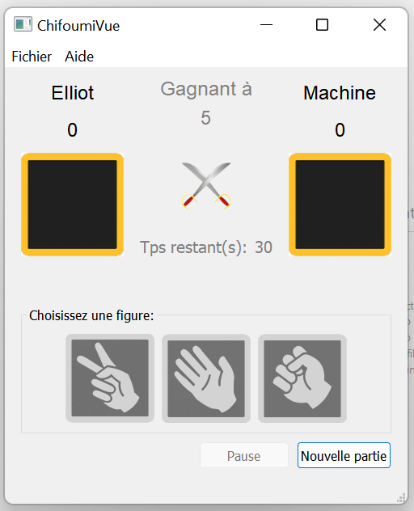

[![Contributors][contributors-shield]][contributors-url]
[![Forks][forks-shield]][forks-url]
[![Stargazers][stars-shield]][stars-url]
[![Issues][issues-shield]][issues-url]

<!-- PROJECT LOGO -->
 
 

  
  
  

  <h3 align="center">Chifoumi</h3>

  

    S2.01 - Développement d'une application
     
    <a href="https://github.com/samuelhentrics/chifoumi/tree/master/docs"><strong>Voir les documents »</strong></a>
     
     
    <a href="https://github.com/samuelhentrics/chifoumi/issues/1">Reporter un bug</a>
    ·
    <a href="https://github.com/samuelhentrics/chifoumi/issues/2">Proposer des fonctionnalités</a>
  

<!-- TABLE OF CONTENTS -->

  
Table des matières

  <ol>
    <li>
      <a href="#a-propos-du-projet">A propos du projet</a>
      <ul>
        <li><a href="#crée-avec">Crée avec</a></li>
      </ul>
    </li>
    <li>
      <a href="#commencer">Commencer</a>
      <ul>
        <li><a href="#pré-requis">Pré-requis</a></li>
        <li><a href="#installation">Installation</a></li>
      </ul>
    </li>
    <li><a href="#roadmap">Roadmap</a></li>
    <li><a href="#contribution">Contribution</a></li>
    <li><a href="#contact">Contact</a></li>
  </ol>

<!-- ABOUT THE PROJECT -->
## A Propos du projet

  

  
Ce projet reprend l'idée du jeu Chifoumi. Ce projet a été fait en BUT Informatique à l'IUT de Bayonne et du Pays Basque durant le semestre 2 lors de la SAE S2.01 - Développement d'une application

/!\ Ne prennez pas compte des commits réalisés par une seule personne : la collaboration sur git n'avait pas encore été vue durant ce semestre.

(<a href="#top">Retour en haut</a>)

### Crée avec

* [C++]
* [Qt](https://www.qt.io/)

(<a href="#top">Retour en haut</a>)

<!-- GETTING STARTED -->
## Commencer

Ceci est un exemple de la façon dont vous pouvez installer le projet localement.
Pour obtenir une copie locale opérationnelle, suivez ces étapes d'exemple simples.

### Pré-requis

* Qt
* C++

### Installation

1. Copier le dossier github
2. Lancer depuis Qt Creator le fichier .pro

(<a href="#top">Retour en haut</a>)

<!-- ROADMAP -->
## Roadmap

Pour plus d'informations, se référer au docs
- [x] v0 Sources C++ de la classe Chifoumi dans un projet Non Qt
- [x] v1 Version décrite dans le paragraphe §1 précédent. La barre de menus est inactive.
- [ ] v2 Le code source est structuré selon le modèle MVC. Amélioration de l’organisation du code
- [x] v3 Le menu Fichier >> Quitter permet d’arrêter l’application. Le menu Aide >> A propos de… ouvre une Boîte de Message donnant des informations
- [x] v4 Le jeu se joue en X points, 5 par défaut.
- [x] v5 Le jeu se joue en temps limité, 30 secondes par défaut.
- [x] v6 L’utilisateur peut modifier différents paramètres avant de commencer la partie : son nom, le nombre max. de points, le temps max. à jouer
- [x] v7 Le nom du joueur est enregistré dans une base de données.
- [x] v8 A la fin de la partie, le système enregistre dans la base de données le résultat de la partie
      (Horodatage, nomJoueurHumain, scoreJoueurHumain, joueurMachine, scoreJoueurMachine)
- [x] v9 Ajout d'une boite de dialogue affichant les résultats enregistrés (Fichier >> Résultats)

(<a href="#top">Retour en haut</a>)

<!-- CONTRIBUTING -->
## Contributions

Les contributions sont ce qui fait de la communauté open source un endroit incroyable pour apprendre, inspirer et créer. Toutes les contributions que vous faites sont **grandement appréciées**.

Si vous avez une suggestion qui améliorerait cela, veuillez "fork" le dépôt et créer une "Pull Request". Vous pouvez aussi simplement ouvrir un ticket avec le tag "amélioration".
N'oubliez pas de mettre une étoile au projet ! Merci encore!

1. "Fork" le projet
2. Créez votre branche de fonctionnalité
3. Validez vos modifications
4. Appuyez sur la branche
5. Ouvrir un Pull Request

(<a href="#top">Retour en haut</a>)

<!-- CONTACT -->
## Contact

Samuel HENTRICS LOISTINE -  samuel.hentrics@gmail.com

Ahmed FAKHFAKH - afakhfakh@iutbayonne.univ-pau.fr

Cédric ETCHEPARE - cetchepar001@iutbayonne.univ-pau.fr

Lien du projet: [https://github.com/samuelhentrics/chifoumi](https://github.com/samuelhentrics/chifoumi)

(<a href="#top">Retour en haut</a>)

<!-- MARKDOWN LINKS & IMAGES -->
<!-- https://www.markdownguide.org/basic-syntax/#reference-style-links -->
[contributors-shield]: https://img.shields.io/github/contributors/samuelhentrics/chifoumi?style=for-the-badge
[contributors-url]: https://github.com/samuelhentrics/chifoumi/graphs/contributors
[forks-shield]: https://img.shields.io/github/forks/samuelhentrics/chifoumi.svg?style=for-the-badge
[forks-url]: https://github.com/samuelhentrics/chifoumi/network/members
[stars-shield]: https://img.shields.io/github/stars/samuelhentrics/chifoumi.svg?style=for-the-badge
[stars-url]: https://github.com/samuelhentrics/chifoumi/stargazers
[issues-shield]: https://img.shields.io/github/issues/samuelhentrics/chifoumi.svg?style=for-the-badge
[issues-url]: https://github.com/samuelhentrics/chifoumi/issues
